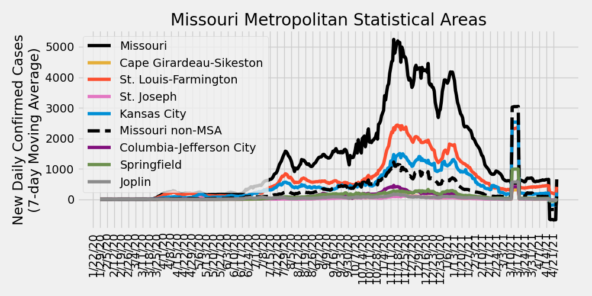
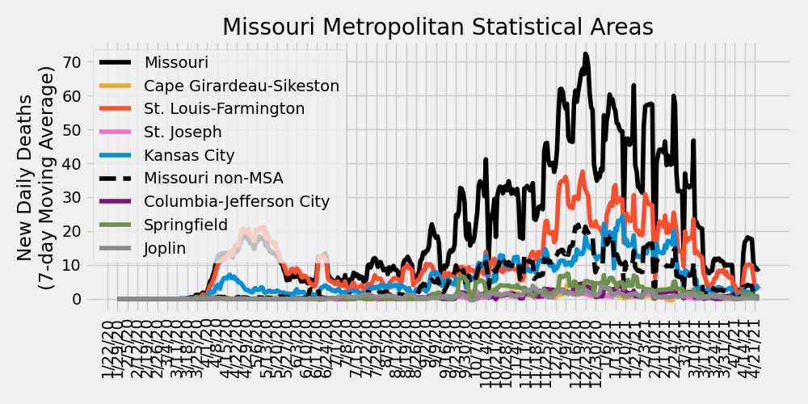
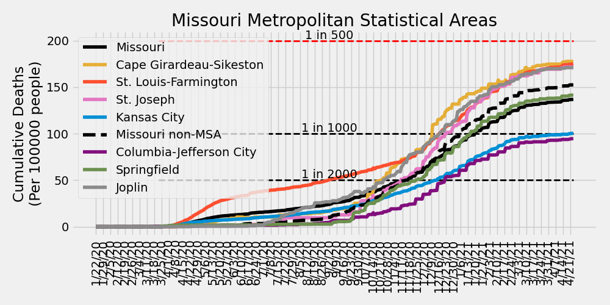
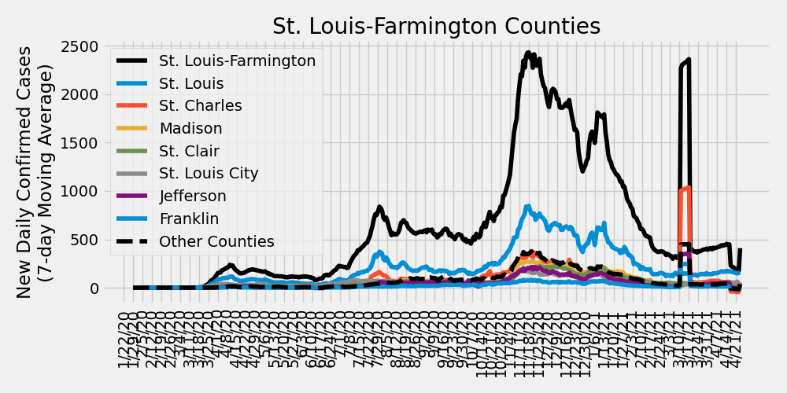
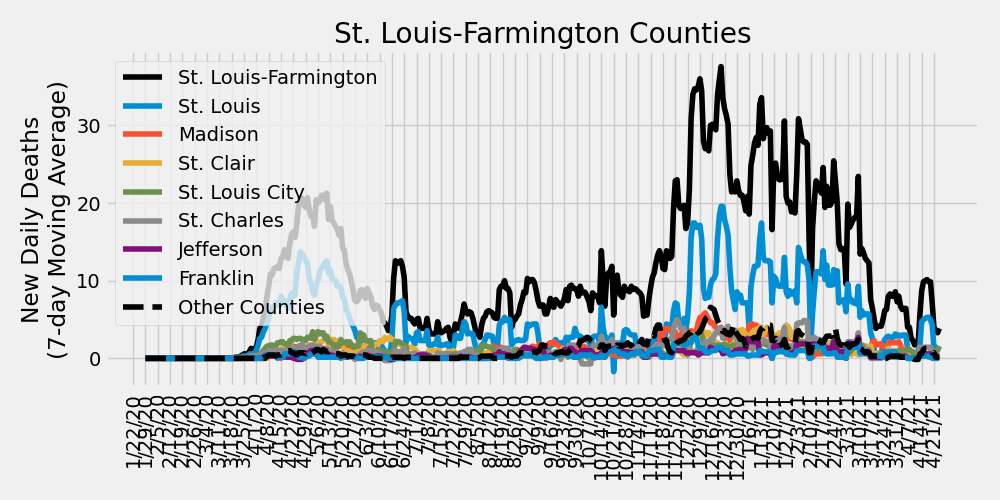
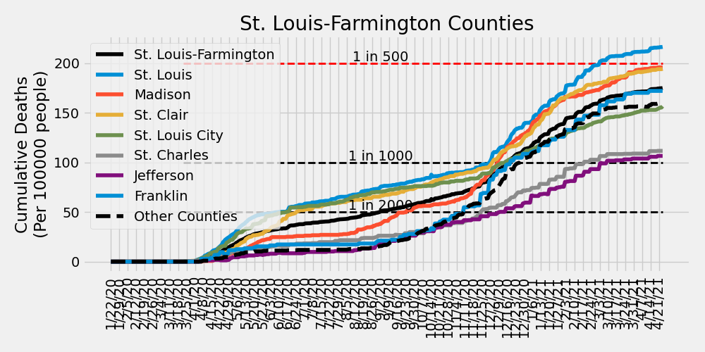

# COVID-19 Missouri Statistics & Regional Breakdowns
Author: Adam J. Vogt  
Final Update: 04/25/2021  
Source: [COVID-19 Data Repository by the Center for Systems Science and Engineering (CSSE) at Johns Hopkins University](https://github.com/CSSEGISandData/COVID-19)  
Source Code: `/ajvogt-analysis/mo_analysis_script.py`  
[Release Notes found below](#release-notes)

This analysis shows the Johns Hopkins University COVID-19 data broken down by 
[Metropolitan Statistcal Area](https://en.wikipedia.org/wiki/Metropolitan_statistical_area) (MSA)
 combinations within the state of Missouri. The list of counties in each MSA comibination can be found in the 
[table](#msa-counties) 
below. The [detailed map of MSAs](https://www2.census.gov/geo/maps/metroarea/us_wall/Sep2018/CBSA_WallMap_Sep2018.pdf) 
can be found here.  The clusters used in the charts and tables below 
are a custom combination of MSAs and 
[Combined Statistical Areas](https://en.wikipedia.org/wiki/Combined_statistical_area) (CSA). 
County populations are pulled from this 
[JHU CSSE repository file](https://github.com/ajvogt/COVID-19/blob/master/csse_covid_19_data/UID_ISO_FIPS_LookUp_Table.csv).

**Update**: This analysis will be paused indefinitely as of 4/25/2021.  Data irregularities due to the mass update and backfill of MO Health Department data has caused issues with having an informative view of the Daily Confirmed Cases.  However, if you are still interested in following these trends, [covidactnow.org](https://covidactnow.org/) provides and excellent resource as a U.S. COVID Risk & Vaccine Tracker.  Corresponding plots can acutally be found here:

* [St. Louis Metro Area](https://covidactnow.org/us/metro/st-louis_mo-il/)
* [Missouri](https://covidactnow.org/us/missouri-mo/)

## Missouri New Daily Confirmed Cases by Metropolitan Statistcal Areas

## Missouri New Daily Deaths by Metropolitan Statistcal Areas

## Missouri Cumulative Deaths by Metropolitan Statistcal Areas

## Missouri Metropolitan Statistical Area Totals
<!-- msa_table start -->
| MSA | Total Deaths | Total Cases | Daily New Cases: Last 7-Day Average | Daily New Cases: Last 14-Day Average | Daily New Cases: Last 30-Day Average |
|-----|-------|--------|---|---|---|
| St. Louis-Farmington | 5025 | 290403 | 408 | 318 | 373 |
| Kansas City | 2656 | 200155 | 219 | 15 | 105 |
| Missouri non-MSA | 2178 | 133470 | 95 | -122 | 0 |
| Springfield | 665 | 44186 | 35 | -8 | 12 |
| Columbia-Jefferson City | 340 | 38044 | 26 | -2 | 9 |
| Joplin | 307 | 20556 | 10 | -10 | 1 |
| Cape Girardeau-Sikeston | 240 | 14990 | 5 | -18 | -5 |
| St. Joseph | 215 | 13123 | 5 | -11 | -1 |
<!-- msa_table end -->

## STL-Farmington MSA New Daily Confirmed Cases by County

## STL-Farmington MSA New Daily Deaths by County

## STL-Farmington MSA Cumulative Deaths by County

## Metropolitan Statistical Area (MSA) Counties
<!-- county_table start -->
| MSA | State | County | Total Deaths | Total Cases | Daily New Cases: Last 7-Day Average | Daily New Cases: Last 14-Day Average | Daily New Cases: Last 30-Day Average |
|-----|-------|--------|---|---|---|---|---|
| St. Louis-Farmington | Missouri | St. Louis | 2153 | 96643 | 157 | 161 | 158 |
| St. Louis-Farmington | Missouri | St. Louis City | 471 | 23780 | 58 | 57 | 48 |
| Kansas City | Missouri | Kansas City | 569 | 42896 | 56 | -7 | 18 |
| St. Louis-Farmington | Missouri | St. Charles | 449 | 42009 | 53 | 6 | 38 |
| Kansas City | Kansas | Johnson | 746 | 57435 | 52 | 52 | 53 |
| Kansas City | Missouri | Jackson | 415 | 37181 | 51 | -28 | 5 |
| St. Louis-Farmington | Missouri | Jefferson | 240 | 22863 | 38 | 20 | 33 |
| St. Louis-Farmington | Illinois | St. Clair | 505 | 27336 | 30 | 30 | 29 |
| St. Louis-Farmington | Illinois | Madison | 515 | 29985 | 27 | 31 | 34 |
| Columbia-Jefferson City | Missouri | Boone | 91 | 17771 | 18 | 5 | 8 |
| Kansas City | Kansas | Wyandotte | 278 | 20096 | 18 | 19 | 17 |
| Springfield | Missouri | Greene | 461 | 27842 | 18 | -2 | 8 |
| Kansas City | Missouri | Clay | 164 | 9814 | 12 | -5 | 0 |
| Kansas City | Missouri | Cass | 107 | 9022 | 11 | -3 | 4 |
| Missouri non-MSA | Missouri | McDonald | 28 | 2372 | 8 | 0 | 1 |
| St. Louis-Farmington | Missouri | Lincoln | 40 | 5682 | 8 | 0 | 6 |
| Joplin | Missouri | Jasper | 233 | 15326 | 7 | -6 | 1 |
| Springfield | Missouri | Christian | 91 | 8325 | 7 | -1 | 1 |
| St. Louis-Farmington | Missouri | Franklin | 179 | 10484 | 7 | -2 | 5 |
| Kansas City | Missouri | Platte | 47 | 4095 | 5 | 0 | 2 |
| Missouri non-MSA | Missouri | Taney | 92 | 5222 | 5 | 0 | 1 |
| St. Louis-Farmington | Illinois | Jersey | 49 | 2650 | 5 | 3 | 3 |
| St. Louis-Farmington | Illinois | Macoupin | 81 | 4622 | 4 | 5 | 5 |
| Springfield | Missouri | Polk | 33 | 3224 | 4 | -4 | 0 |
| Missouri non-MSA | Missouri | Howell | 43 | 3460 | 4 | -3 | 0 |
| St. Joseph | Missouri | Buchanan | 142 | 9187 | 4 | -7 | 0 |
| Missouri non-MSA | Missouri | Camden | 87 | 4067 | 4 | 1 | 2 |
| Missouri non-MSA | Missouri | Phelps | 128 | 3789 | 4 | 0 | 4 |
| St. Louis-Farmington | Illinois | Bond | 24 | 2002 | 4 | 3 | 2 |
| Springfield | Missouri | Webster | 53 | 3555 | 4 | 1 | 1 |
| St. Louis-Farmington | Missouri | St. Francois | 115 | 8713 | 4 | -7 | -1 |
| Columbia-Jefferson City | Missouri | Cole | 122 | 9031 | 3 | -3 | 0 |
| Cape Girardeau-Sikeston | Missouri | Cape Girardeau | 134 | 8747 | 3 | -13 | -4 |
| St. Louis-Farmington | Missouri | Warren | 22 | 3077 | 3 | 0 | 2 |
| St. Louis-Farmington | Illinois | Clinton | 90 | 5721 | 3 | 2 | 2 |
| Missouri non-MSA | Missouri | Marion | 44 | 3591 | 3 | -3 | 3 |
| Joplin | Missouri | Newton | 74 | 5230 | 3 | -3 | 0 |
| Missouri non-MSA | Missouri | Perry | 30 | 2186 | 3 | 0 | 1 |
| Missouri non-MSA | Missouri | Dunklin | 22 | 2785 | 3 | 0 | 1 |
| Missouri non-MSA | Missouri | Pettis | 78 | 5082 | 3 | 0 | 0 |
| Kansas City | Kansas | Miami | 42 | 2731 | 2 | 3 | 2 |
| Missouri non-MSA | Missouri | Wright | 30 | 1557 | 2 | 0 | 0 |
| Kansas City | Kansas | Leavenworth | 90 | 7153 | 2 | 4 | 4 |
| Missouri non-MSA | Missouri | Butler | 42 | 4153 | 2 | -1 | 1 |
| Missouri non-MSA | Missouri | Crawford | 36 | 2546 | 2 | 0 | 3 |
| Missouri non-MSA | Missouri | Henry | 38 | 1997 | 2 | -1 | 0 |
| Missouri non-MSA | Missouri | Lewis | 13 | 1004 | 2 | -3 | 0 |
| Missouri non-MSA | Missouri | Johnson | 50 | 4734 | 2 | -15 | -5 |
| Missouri non-MSA | Missouri | Vernon | 43 | 1920 | 2 | -4 | 0 |
| Missouri non-MSA | Missouri | Pemiscot | 30 | 1569 | 1 | 1 | 0 |
| Missouri non-MSA | Missouri | Stone | 41 | 2398 | 1 | 0 | 1 |
| Missouri non-MSA | Missouri | Madison | 16 | 1621 | 1 | -1 | 0 |
| St. Louis-Farmington | Illinois | Monroe | 90 | 4323 | 1 | 3 | 5 |
| Kansas City | Missouri | Clinton | 65 | 1941 | 1 | -7 | -3 |
| Missouri non-MSA | Missouri | Pulaski | 51 | 3438 | 1 | -1 | 0 |
| Missouri non-MSA | Missouri | Ste. Genevieve | 16 | 1803 | 1 | -1 | 0 |
| Cape Girardeau-Sikeston | Missouri | Scott | 83 | 4677 | 1 | -2 | 0 |
| Kansas City | Missouri | Lafayette | 56 | 3013 | 1 | -5 | -1 |
| Columbia-Jefferson City | Missouri | Callaway | 47 | 4913 | 1 | 0 | 0 |
| Missouri non-MSA | Missouri | Cedar | 21 | 1071 | 1 | -1 | 0 |
| Missouri non-MSA | Missouri | New Madrid | 43 | 2101 | 1 | -1 | 0 |
| Missouri non-MSA | Missouri | Iron | 6 | 873 | 1 | -2 | 0 |
| Missouri non-MSA | Missouri | Randolph | 30 | 2625 | 1 | -4 | 0 |
| Missouri non-MSA | Missouri | Pike | 24 | 1770 | 1 | -2 | 0 |
| Missouri non-MSA | Missouri | Ralls | 12 | 1052 | 1 | 0 | 0 |
| Missouri non-MSA | Missouri | Miller | 54 | 2521 | 1 | 0 | 0 |
| Columbia-Jefferson City | Missouri | Cooper | 27 | 1901 | 1 | 0 | 0 |
| Columbia-Jefferson City | Missouri | Osage | 15 | 1613 | 1 | -1 | 0 |
| Kansas City | Missouri | Ray | 27 | 1928 | 1 | -2 | 0 |
| Missouri non-MSA | Missouri | Lawrence | 81 | 3369 | 1 | -3 | 0 |
| Missouri non-MSA | Missouri | Adair | 19 | 2355 | 1 | -3 | 0 |
| Missouri non-MSA | Missouri | Holt | 13 | 438 | 1 | 0 | 0 |
| Missouri non-MSA | Missouri | Stoddard | 37 | 2466 | 1 | -2 | 0 |
| Missouri non-MSA | Missouri | Montgomery | 11 | 1027 | 1 | 0 | 0 |
| Missouri non-MSA | Missouri | Dent | 17 | 948 | 0 | 0 | 1 |
| Missouri non-MSA | Missouri | Atchison | 6 | 451 | 0 | 0 | 0 |
| Springfield | Missouri | Dallas | 27 | 1240 | 0 | -1 | 0 |
| Missouri non-MSA | Missouri | Chariton | 7 | 667 | 0 | 0 | 0 |
| Missouri non-MSA | Missouri | Washington | 49 | 2689 | 0 | -3 | -1 |
| Missouri non-MSA | Missouri | Barry | 45 | 2872 | 0 | -1 | 0 |
| Missouri non-MSA | Missouri | Linn | 13 | 1174 | 0 | -2 | 0 |
| Missouri non-MSA | Missouri | Barton | 14 | 1165 | 0 | 0 | 0 |
| Missouri non-MSA | Missouri | Shelby | 7 | 571 | 0 | -1 | 0 |
| St. Louis-Farmington | Illinois | Calhoun | 2 | 513 | 0 | 0 | 0 |
| Missouri non-MSA | Missouri | Laclede | 68 | 3250 | 0 | -1 | 0 |
| Missouri non-MSA | Missouri | Morgan | 43 | 1704 | 0 | 0 | 0 |
| Missouri non-MSA | Missouri | Carroll | 23 | 1029 | 0 | -2 | 0 |
| Missouri non-MSA | Missouri | Texas | 23 | 1817 | 0 | 0 | 0 |
| Missouri non-MSA | Missouri | Gasconade | 44 | 1519 | 0 | -3 | -1 |
| Missouri non-MSA | Missouri | St. Clair | 8 | 779 | 0 | 0 | 0 |
| Kansas City | Kansas | Linn | 8 | 799 | 0 | 0 | 0 |
| Missouri non-MSA | Missouri | Saline | 38 | 2819 | 0 | -5 | -2 |
| Missouri non-MSA | Missouri | Ripley | 15 | 1060 | 0 | -1 | 0 |
| Missouri non-MSA | Missouri | Douglas | 27 | 895 | 0 | 0 | 0 |
| Missouri non-MSA | Missouri | Audrain | 57 | 2695 | 0 | -5 | -2 |
| Missouri non-MSA | Missouri | Macon | 15 | 1534 | 0 | -4 | 0 |
| St. Joseph | Missouri | Andrew | 19 | 1846 | 0 | -2 | 0 |
| Kansas City | Missouri | Bates | 29 | 1300 | 0 | -2 | 0 |
| Missouri non-MSA | Missouri | Nodaway | 25 | 2684 | 0 | 1 | 1 |
| Columbia-Jefferson City | Missouri | Moniteau | 31 | 1773 | 0 | 0 | 0 |
| St. Joseph | Missouri | DeKalb | 31 | 1125 | 0 | -1 | 0 |
| Missouri non-MSA | Missouri | Benton | 32 | 1647 | 0 | -1 | 0 |
| Missouri non-MSA | Missouri | Grundy | 34 | 984 | 0 | -1 | 0 |
| Missouri non-MSA | Missouri | Livingston | 40 | 1651 | 0 | -5 | -2 |
| Missouri non-MSA | Missouri | Knox | 2 | 374 | 0 | 0 | 0 |
| Missouri non-MSA | Missouri | Maries | 8 | 630 | 0 | 0 | 0 |
| Kansas City | Missouri | Caldwell | 13 | 751 | 0 | -1 | 0 |
| Cape Girardeau-Sikeston | Missouri | Bollinger | 12 | 1103 | 0 | -1 | 0 |
| Missouri non-MSA | Missouri | Carter | 10 | 540 | 0 | 0 | 0 |
| Missouri non-MSA | Missouri | Sullivan | 14 | 841 | 0 | -1 | 0 |
| Missouri non-MSA | Missouri | Daviess | 11 | 697 | 0 | -2 | -1 |
| Missouri non-MSA | Missouri | Wayne | 11 | 1028 | 0 | 0 | 0 |
| Missouri non-MSA | Missouri | Mercer | 2 | 299 | 0 | 0 | 0 |
| Missouri non-MSA | Missouri | Reynolds | 3 | 376 | 0 | 0 | 0 |
| Cape Girardeau-Sikeston | Illinois | Alexander | 11 | 463 | 0 | 0 | 0 |
| Missouri non-MSA | Missouri | Schuyler | 6 | 333 | 0 | 0 | 0 |
| Missouri non-MSA | Missouri | Harrison | 14 | 875 | 0 | -3 | -1 |
| Missouri non-MSA | Missouri | Mississippi | 28 | 1436 | 0 | 0 | 0 |
| Missouri non-MSA | Missouri | Hickory | 15 | 640 | 0 | 0 | 0 |
| Unassigned/Out of MO | Missouri | Unassigned | 0 | 0 | 0 | 0 | 0 |
| Missouri non-MSA | Missouri | Worth | 2 | 162 | 0 | 0 | 0 |
| Missouri non-MSA | Missouri | Monroe | 11 | 996 | 0 | -1 | 0 |
| Missouri non-MSA | Missouri | Clark | 7 | 663 | 0 | 0 | 0 |
| Missouri non-MSA | Missouri | Dade | 16 | 573 | 0 | 0 | 0 |
| Missouri non-MSA | Missouri | Oregon | 3 | 794 | 0 | -4 | -1 |
| St. Joseph | Kansas | Doniphan | 23 | 965 | 0 | 0 | 0 |
| Unassigned/Out of MO | Missouri | Out of MO | 0 | 0 | 0 | 0 | 0 |
| Missouri non-MSA | Missouri | Ozark | 17 | 642 | 0 | -2 | -1 |
| Missouri non-MSA | Missouri | Gentry | 20 | 822 | 0 | -1 | 0 |
| Columbia-Jefferson City | Missouri | Howard | 7 | 1042 | 0 | -1 | 0 |
| Missouri non-MSA | Missouri | Putnam | 4 | 297 | 0 | 0 | 0 |
| Missouri non-MSA | Missouri | Scotland | 3 | 305 | 0 | 0 | 0 |
| Missouri non-MSA | Missouri | Shannon | 12 | 581 | 0 | 0 | 0 |
<!-- county_table end -->

## Release Notes

### Release Notes
* 4/25/2021: final update for this project
* 1/17/2021: including cumulative deaths plots
* 1/4/2021: small fix for including 2021 data
* 7/20/2020:
  * update table insertion code
  * fix cases vs. deaths total header bug
  * include MSA totals table
  * added STL-Farmington County-level Deaths & Cases plots
  * including release notes in missouri_analysis.md
* 7/19/2020: 
  * code refactor
  * updating color scheme for plots
  * updating county numbers to table to include
  latest new daily case average numbers and
  sorting by last 7-day average
* 6/19/2020: Added description of MSAs & CSAs
* 6/16/2020: Including individual county totals (only) in analysis md table
* 6/11/2020:
  * Updated MSA definitions
  * Including table of individual county case counts
* 6/7/2020: Creating markdown & script
  * Including list of county-MSA/CSA associations to markdown
  * Including cumulative totals in MSA/CSA plots
* 5/30/2020: including plots of cumulative cases/deaths in jupyter notebook
* 5/17/2020: Initial analysis jupyter notebook created
* 4/4/2020: Cloned JHU CSSE Repository and set up development environment

### To-Do (updated 1/17/2021)
- [ ] Verify county population data

#### Analysis Page
- [x] Update description to accurately reflect CSA vs. MSA
- [x] Make table for CSA info
- [x] Include 7, 14, & 30 day changes for each county
- [ ] Plot top CSAs (for latest daily case change) with testing data
- [x] Analysis breakdown of St. Louis-Farmington counties
- [x] Include release notes and to-do list
- [ ] ~~Update color scheme~~, plot markers, and line thickness
- [ ] Include table of contents

#### Analysis Script
- [x] Simplify data ingestion and summarization functionality
- [x] Simplify plotting functionality
- [x] Include ability to update markdown with table between markdown sections
